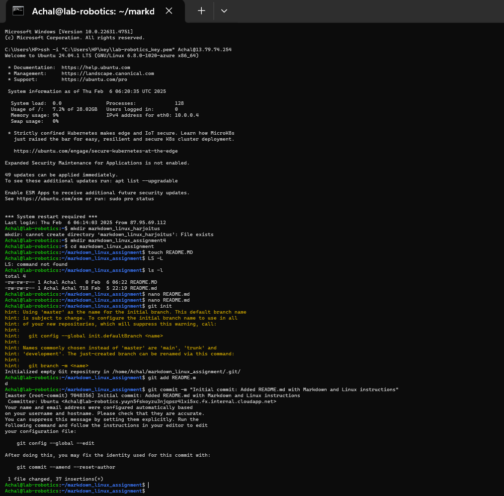
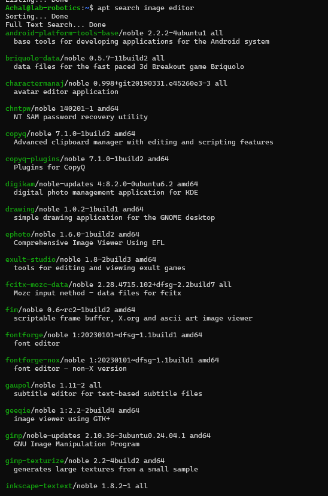
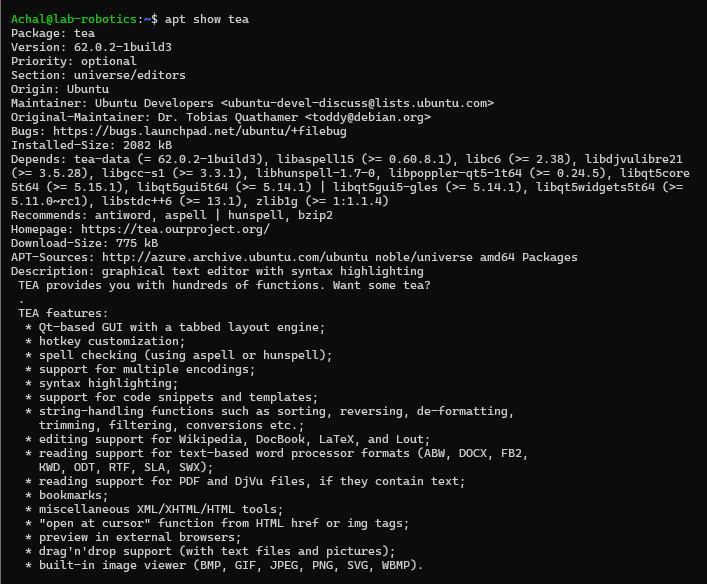
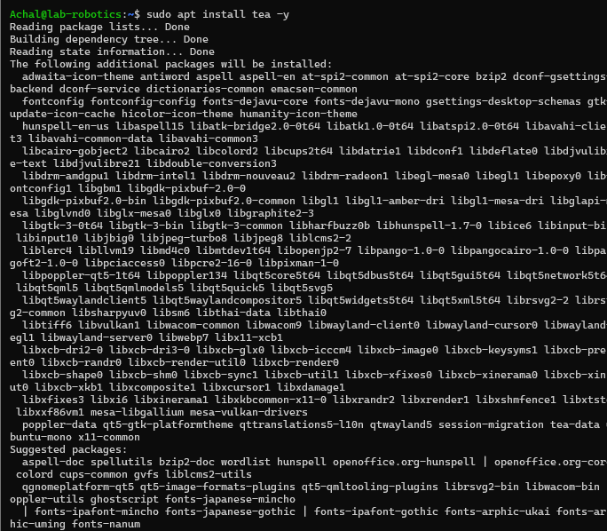
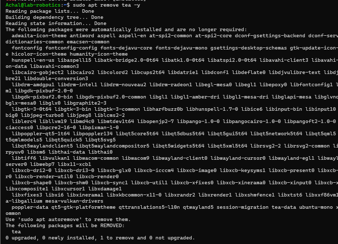
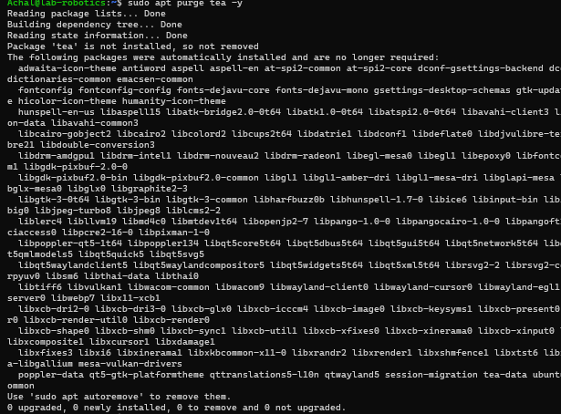
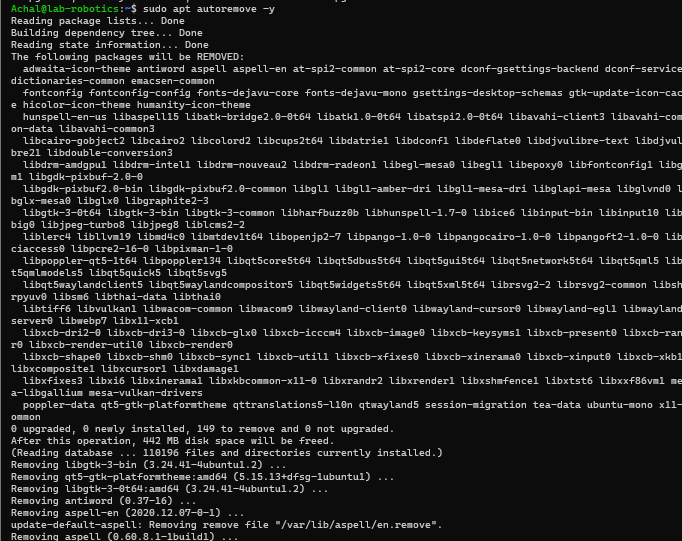

# Achal Thapa

# APT Package Management Assignment

## Part 1: Understanding APT & System Updates

### 1. Check APT Version
sh
apt --version

*Output:*

### 2. Update the Package List
sh
sudo apt update

*Explanation:*  
This command fetches the latest package information from the configured repositories, ensuring that the system has the most up-to-date metadata before installing or upgrading packages.

### 3. Upgrade Installed Packages
sh
sudo apt upgrade -y

**Difference between update and upgrade:**  
- update refreshes the package metadata but does not install or upgrade anything.
- upgrade installs newer versions of the packages based on the updated metadata.

### 4. View Pending Updates
sh
apt list --upgradable

*Pending Updates:*  

## Part 2: Installing & Managing Packages

### 1. Search for a Package
sh
apt search image editor

*Selected Package:*  

### 2. View Package Details
sh
apt show tea

*Dependencies:*  

### 3. Install the Package
sh
sudo apt install tea -y

*Confirmation of Installation:*  

### 4. Check Installed Package Version
sh
apt list --installed | grep tea

*Installed Version:*  

## Part 3: Removing & Cleaning Packages

### 1. Uninstall the Package
sh
sudo apt remove tea -y

*Is the package fully removed?*  

### 2. Remove Configuration Files
sh
sudo apt purge tea -y

**Difference between remove and purge:**  
- remove only deletes the package binaries, keeping configuration files.
- purge deletes both binaries and configuration files.

### 3. Remove Unnecessary Dependencies
sh
sudo apt autoremove -y

*Why is this step important?*  
It removes unused dependencies that were installed alongside a package but are no longer needed, freeing up disk space.

### 4. Clean Up Downloaded Package Files
sh
sudo apt clean

*What does this command do?*  
It deletes all downloaded .deb files from /var/cache/apt/archives, freeing up space.

## Part 4: Managing Repositories & Troubleshooting

### 1. List APT Repositories
sh
cat /etc/apt/sources.list

*Observations:*  

### 2. Add a New Repository
sh
sudo add-apt-repository universe
sudo apt update

*Types of Packages in Universe Repository:*  
Community-maintained software, which may not receive the same level of support as main repository packages.

### 3. Simulate an Installation Failure
sh
sudo apt install fakepackage

*Error Message:*  

### 4. Troubleshooting Steps
- Check the package name spelling.
- Ensure the correct repository is enabled.
- Run sudo apt update and try again.
- Search for the package using apt search.
- Check logs in /var/log/apt/.

---

## Bonus Challenge: Holding & Unholding Packages

### 1. Hold a Package
sh
sudo apt-mark hold tea

### 2. Unhold a Package
sh
sudo apt-mark unhold tea

*Why would you want to hold a package?*  
This prevents the package from being upgraded.

*Why would you want to unhold a package?*
This allows the package to be upgraded again.

#### Thank You !!!